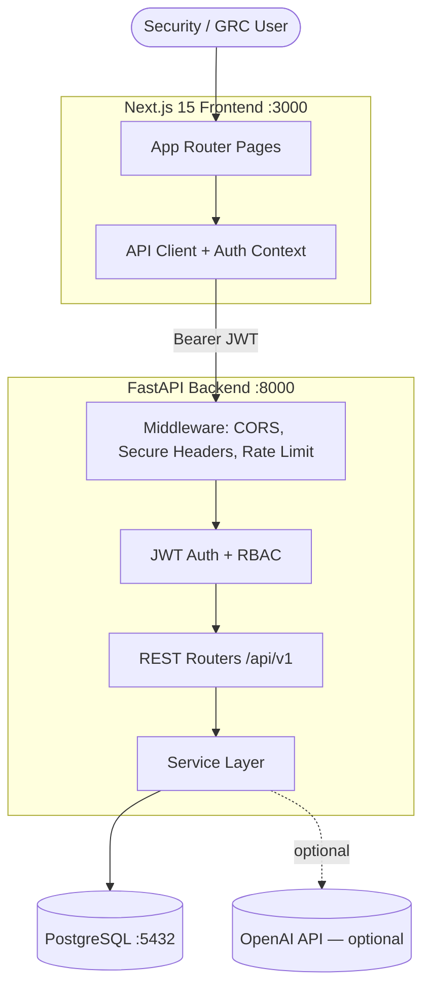
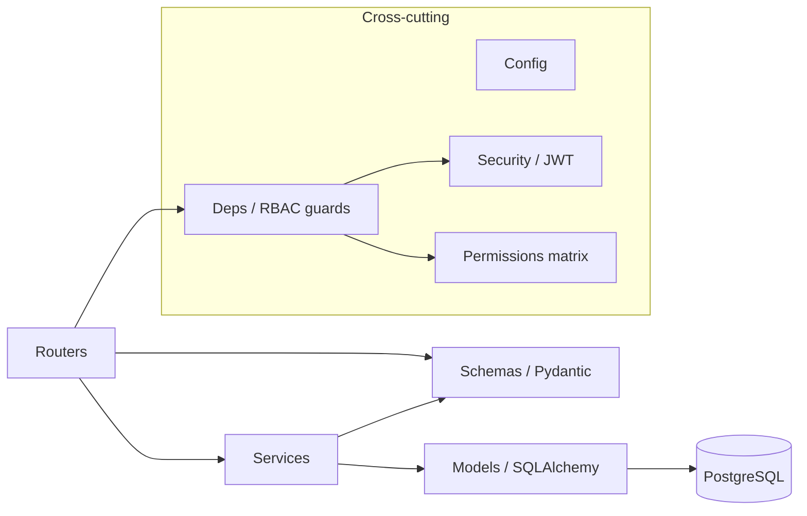
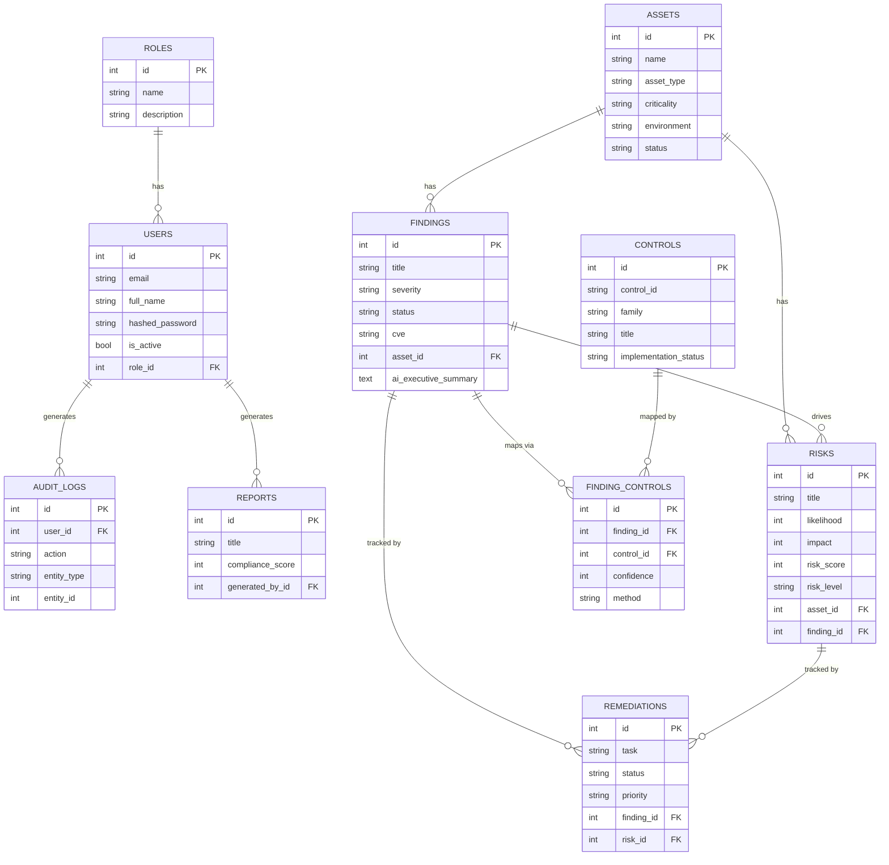
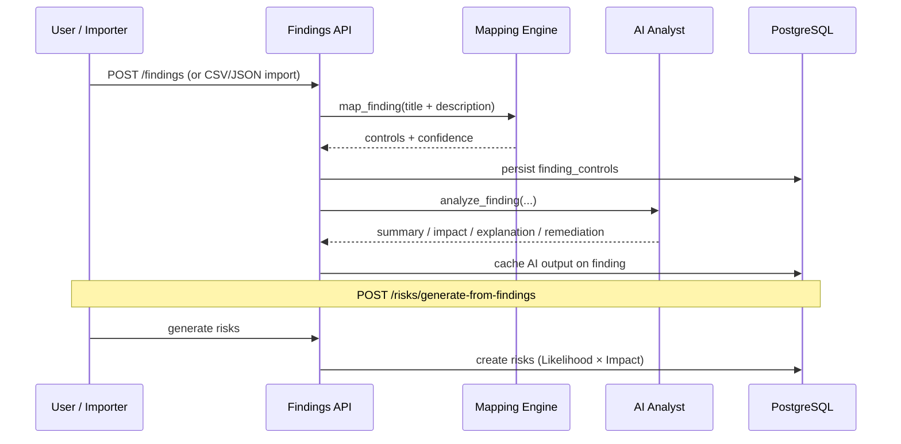
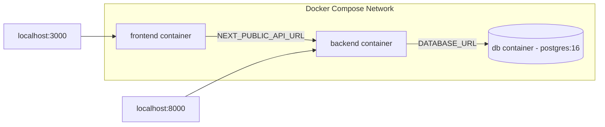

# Security Compliance & Risk Management Analyzer — Architecture

## System context

## Component layering (backend)

## Entity‑relationship diagram

## Finding ingestion → mapping → risk flow

## Deployment topology

